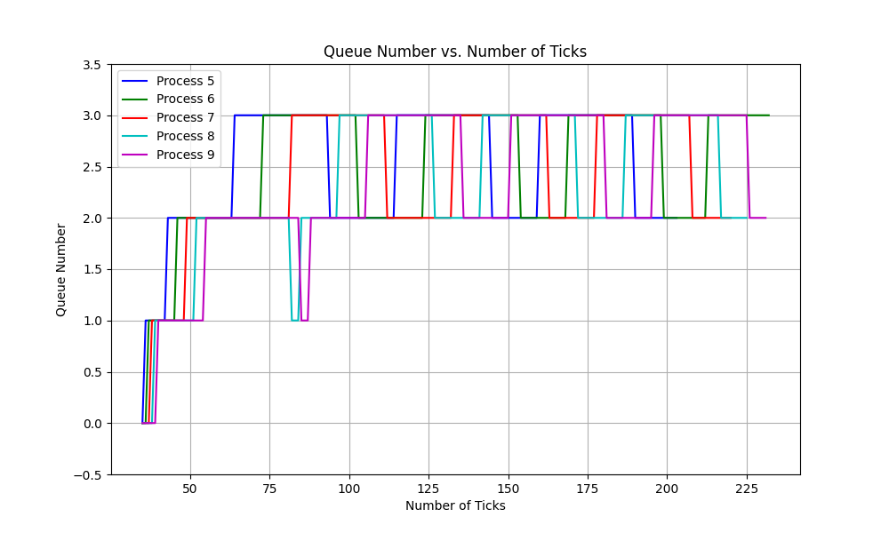

[](https://classroom.github.com/a/DLipn7os)
# Intro to Xv6
OSN Monsoon 2023 mini project 2


- Instructions to test the xv6 implementations are given in the `initial_xv6/README.md` file. 


## Implementation of various scheduled algorithm that have been implemented in xv6

### FCFS

- In FCFS, the process that comes first in the ready queue is selected first. The process that comes next is selected only when the first process is completed. This scheduling algorithm is non-preemptive. Processes are executed on first come, first serve basis.

- Therefore, a new variable is created named ctime which stores the ticks when it has been created. This can be seen in the function allocproc under ```./initial-xv6/src/proc.c``` file

- In the same file, the implementation of the algorithm is seen in the scheduler function where the process with the least ctime is selected first, and then the next process is selected only when the first process is completed.

### MLFQ

- In MLFQ, the processes are divided into different queues based on their priority. The process with the highest priority is selected first for execution. If two processes have the same priority, then RR is used in that priority. This scheduling algorithm is preemptive.

- For this, a few new variables have been created that store the priority/queue it is stored in. This can be seen in the function allocproc under ```./initial-xv6/src/proc.c``` file. Other variables include, runtime_queue which basically stores the time since it was last run (This is helpful for starvation).

- 4 different queues in the form of arrays are used with various timeslices {1, 3, 9, 15} for the same and two new are created to handle the push and pop feature for the queues. This can be seen in the function scheduler under ```./initial-xv6/src/proc.c``` file.

- Main implementation of the algorithm can be seen under the scheduler function. 

- The function first checks for if the process are done, if so, they are removed out of the queues and we move ahead by pushing it to the queue. If a process runs for more than the timeslice given to it, then the process is shifted to a lower priority queue.

- The function also checks for starvation, wherein it checks if the process has been in the queue for more than 30 ticks, if so, it is shifted to a higher priority queue.And finally it checks for the process with the highest priority and runs it.

- A file ```MLFQ.png``` has been added to the repository which shows an analysis of the MLFQ algorithm.

### A table comparing the performances of all the algorithms

Algorithm | Average Run Time | Waiting Time
------------ | ------------- | -------------
RR (Default) | 18 | 172
FCFS | 19 | 137
MLFQ | 18 | 181

### Timeline Graph picturing the running of MLFQ algorithm


